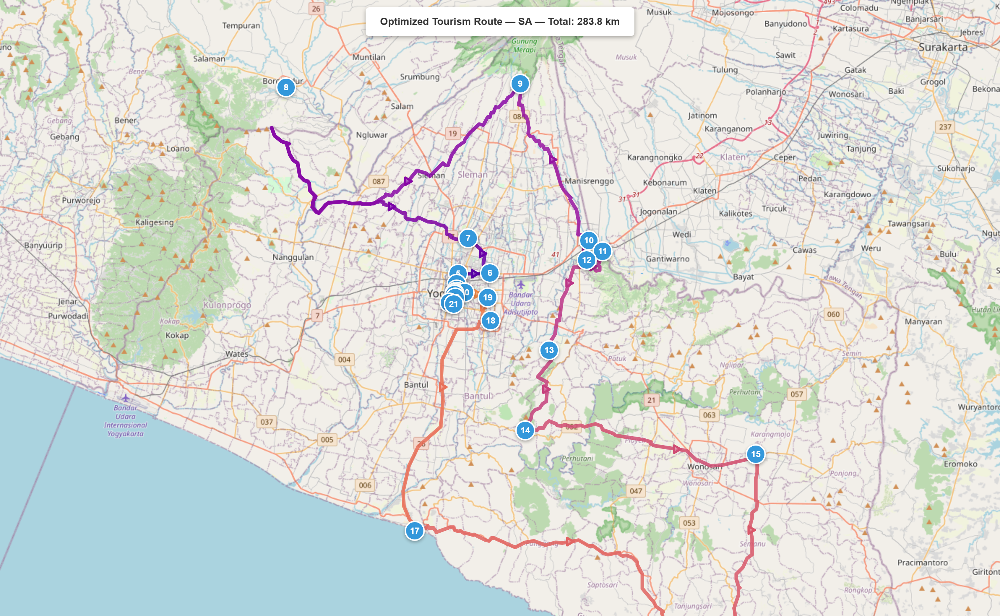

# Comparative Analysis of Metaheuristic Algorithms for Tourism Route Optimization Using Real Road Network Distances: A Case Study of Yogyakarta Special Region, Indonesia

**First Author^a,\*^, Second Author^b^, Third Author^b^**

^a^ *Department, University, Address, City, Postal Code, Country*

^b^ *Department, University, Address, City, Postal Code, Country*

\* *Corresponding author: email@university.ac.id*

---

## Abstract

This study evaluates four metaheuristic algorithms for tourism route optimization in Yogyakarta Special Region (DIY), Indonesia, formulated as a Travelling Salesman Problem (TSP) over 25 tourist attractions. Road distances were computed using Dijkstra's algorithm on an OpenStreetMap network comprising 153,334 nodes and 200,104 edges, replacing the Euclidean approximations commonly adopted in prior work. The algorithms compared are Max-Min Ant System (MMAS), Ant Colony System (ACS), Genetic Algorithm (GA), and Simulated Annealing (SA), with a Nearest Neighbor (NN) heuristic as baseline. Each stochastic algorithm was executed 30 times with distinct random seeds. SA produced the shortest mean route of 283.82 km with a standard deviation of 0.08 km, followed by MMAS at 284.35 km, ACS at 285.49 km, GA at 302.13 km, and NN at 297.10 km. Wilcoxon signed-rank tests confirmed that all six pairwise differences among stochastic algorithms are statistically significant at p < 0.05. ACS was the fastest metaheuristic at 0.33 s per run, whereas SA required 3.49 s. Parameter sensitivity experiments on MMAS revealed that the evaporation rate is its most influential parameter, and scalability tests showed that GA quality degrades sharply beyond 15 nodes. The mean road-to-Euclidean distance ratio of 1.15 to 1.20 confirms that Euclidean approximations introduce systematic underestimation, supporting the use of real road data for route planning.

**Keywords:** tourism route optimization, Travelling Salesman Problem, Ant Colony Optimization, Simulated Annealing, Genetic Algorithm, OpenStreetMap, Yogyakarta

---

## I. INTRODUCTION

Yogyakarta Special Region (Daerah Istimewa Yogyakarta, DIY) receives more than 4.5 million visitors per year and offers attractions ranging from the UNESCO-listed Borobudur and Prambanan temples to coastal and volcanic landscapes [1]. Visitors who wish to cover many sites in limited time face a route-planning problem that maps directly onto the Travelling Salesman Problem (TSP) [2]. Because TSP is NP-hard, the number of feasible tours grows factorially and exact enumeration becomes impractical for more than roughly 20 locations [3].

Metaheuristic algorithms offer approximate solutions within reasonable computation budgets. Ant Colony Optimization variants exploit pheromone-based reinforcement learning [4], [5], Genetic Algorithms apply selection, crossover, and mutation operators [9], and Simulated Annealing accepts uphill moves with a probability that decreases according to a cooling schedule [7]. All four approaches have been applied to TSP benchmarks, yet their relative merits depend on problem size, distance metric, and implementation details [2], [3].

A persistent weakness in tourism route studies is the reliance on Euclidean or haversine distances [23]. Road networks contain one-way streets, bridges, and topographic detours that cause actual travel distances to exceed straight-line estimates by 15 to 100 percent. Yogyakarta's geography, which features a volcanic slope to the north, limestone karst to the south, and dense urban fabric in the centre, amplifies these discrepancies. Using simplified distances therefore risks producing routes that look optimal on paper but perform poorly on the ground.

This paper addresses the gap by computing a 25 by 25 road-distance matrix via Dijkstra's algorithm on the OpenStreetMap network for the full DIY administrative region (153,334 nodes, 200,104 edges) and using it to compare MMAS, ACS, GA, and SA over 30 independent runs each. The comparison covers solution quality, variance, computation time, convergence speed, and statistical significance through all-pairwise Wilcoxon signed-rank tests. Parameter sensitivity analysis of 27 MMAS configurations and scalability testing across problem sizes of 10, 12, 15, 20, and 25 nodes complement the main experiment. The Euclidean-to-road distance ratio is also quantified, confirming that network-based distances are necessary for practical route planning.

The remainder of this paper is organized as follows. Section II reviews related work on TSP, metaheuristic algorithms, and tourism route optimization. Section III describes the methodology including data collection, algorithm implementations, and experimental design. Section IV reports and discusses the results. Section V concludes the study with recommendations for future work.

---

## II. RELATED WORK

### A. The Travelling Salesman Problem

The Travelling Salesman Problem seeks the minimum-cost Hamiltonian cycle through n cities [2]. For symmetric TSP with n cities the solution space contains (n-1)!/2 tours, rendering brute-force search infeasible beyond approximately n = 20 [3]. Advanced heuristics such as the Lin-Kernighan-Helsgaun (LKH) algorithm [15] and modified metaheuristic approaches [16] can produce near-optimal solutions for large instances, but population-based and trajectory-based metaheuristics remain the practical choice for real-time or resource-constrained settings.

### B. Ant Colony Optimization

Dorigo, Maniezzo, and Colorni introduced Ant System (AS), in which artificial ants deposit pheromone on edges proportional to solution quality [4]. Stutzle and Hoos proposed MMAS, which bounds pheromone values between tau_min and tau_max to prevent stagnation and allows only the iteration-best or global-best ant to update trails [5]. Dorigo and Gambardella developed ACS, which adds a pseudo-random proportional rule controlled by a parameter q0 and applies local pheromone decay during tour construction [6]. Comparative studies on TSPLIB benchmarks show that MMAS and ACS generally outperform basic AS, with the ranking depending on instance structure and parameter tuning [5], [6]. Recent improvements include adaptive heuristic factors [14], enhanced pheromone strategies for large-scale instances [12], and improved exploration-exploitation balance through hybrid approaches [13], [29].

### C. Genetic Algorithms for TSP

The GA framework has been applied to TSP through permutation-preserving operators [9]. The Order Crossover (OX) operator copies a random subtour from one parent and fills the remaining positions from the other while respecting city uniqueness [10]. Tournament selection provides tunable selection pressure, and elitism prevents regression by copying top individuals into the next generation [9]. Recent work has combined reinforcement learning with GA operators for improved TSP performance [17]. GA quality on TSP depends on population size, crossover rate, and whether local search hybridization is applied [10].

### D. Simulated Annealing for TSP

Kirkpatrick, Gelatt, and Vecchi demonstrated that a Metropolis acceptance criterion combined with a cooling schedule can escape local optima in combinatorial problems [7]. For TSP, the 2-opt move introduced by Croes [8], which reverses a segment of the tour, is the standard neighbourhood operator. Gunawan and Iryanto confirmed that SA combined with 2-opt remains competitive for TSP instances of moderate size [11]. The cooling schedule parameters, including initial temperature, cooling rate, and final temperature, govern the exploration-exploitation trade-off and strongly affect both solution quality and runtime [11].

### E. Tourism Route Optimization

Ruiz-Meza and Montoya-Torres [18] provided a systematic review of the tourist trip design problem, covering orienteering formulations with time windows, personalised day-tour routing [19], and multi-day itinerary design. Sylejmani et al. [20] tested meta-heuristic techniques on tourist trip planning with attraction patterns. Sun et al. [25] proposed a multi-objective ACO for travel route recommendation. Most published studies use Euclidean or haversine distances rather than real road network distances. Boeing's OSMnx library [21] made it practical to extract real road networks and compute shortest-path distances programmatically [22]. Boyaci et al. [23] showed that Euclidean approximations in vehicle routing introduce systematic errors, and Tatit et al. [24] confirmed that road network distances differ substantially from Euclidean distances in spatial queries.

Within Indonesia, Nasution et al. [26] applied vehicle routing with time windows to tourism itinerary recommendation, and Fathurrohman et al. [27] formulated a green orienteering problem for tourism in Yogyakarta [28]. Neither study provided the multi-algorithm statistical comparison over real road distances that the present work offers.

---

## III. MATERIALS AND METHOD

### A. Problem Formulation

Let V = {1, 2, ..., n} be a set of n = 25 tourist attractions. The objective is to find a permutation pi = (pi_1, ..., pi_n) that minimises the total route distance:

$$D(\pi) = \sum_{i=1}^{n-1} d(\pi_i, \pi_{i+1}) + d(\pi_n, \pi_1)$$

where d(i, j) denotes the shortest road distance between attractions i and j.

### B. Study Area and Data Collection

The study area spans the full administrative region of DIY. Twenty-five attractions were selected to represent six categories: cultural heritage (7 sites), temples (2 sites), nature and adventure (5 sites), museums (4 sites), monuments (2 sites), and urban and recreational sites (5 sites). Coordinates were geocoded from official tourism data. Table 1 lists all 25 attractions with their geographic coordinates and categories.

**Table 1.** Tourist attractions in Yogyakarta Special Region.

| ID | Name | Category | Lat. | Long. |
|----|------|----------|------|-------|
| 1 | Kraton Yogyakarta | Cultural Heritage | -7.8053 | 110.3642 |
| 2 | Taman Sari Water Castle | Historical | -7.8100 | 110.3592 |
| 3 | Benteng Vredeburg Museum | Museum | -7.8003 | 110.3660 |
| 4 | Tugu Yogyakarta | Monument | -7.7830 | 110.3670 |
| 5 | Malioboro Street | Shopping/Cultural | -7.7925 | 110.3660 |
| 6 | Pasar Beringharjo | Traditional Market | -7.7983 | 110.3660 |
| 7 | Museum Sonobudoyo | Museum | -7.8018 | 110.3638 |
| 8 | Alun-Alun Kidul | Public Square | -7.8120 | 110.3635 |
| 9 | Alun-Alun Utara | Public Square | -7.8030 | 110.3638 |
| 10 | Taman Pintar Science Park | Educational | -7.8005 | 110.3670 |
| 11 | Kebun Binatang Gembira Loka | Zoo | -7.8056 | 110.3953 |
| 12 | Museum Affandi | Art Museum | -7.7825 | 110.3973 |
| 13 | Kotagede Heritage Area | Heritage District | -7.8273 | 110.3983 |
| 14 | Monumen Jogja Kembali | Monument/Museum | -7.7500 | 110.3767 |
| 15 | Purawisata | Cultural Performance | -7.8010 | 110.3735 |
| 16 | Candi Prambanan | Temple | -7.7520 | 110.4914 |
| 17 | Candi Ratu Boko | Archaeological Site | -7.7704 | 110.4892 |
| 18 | Tebing Breksi | Nature/Cliff | -7.7620 | 110.5043 |
| 19 | Museum Ullen Sentalu | Museum | -7.6041 | 110.4264 |
| 20 | Candi Borobudur | Temple | -7.6078 | 110.2038 |
| 21 | Pantai Parangtritis | Beach | -8.0254 | 110.3264 |
| 22 | Hutan Pinus Mangunan | Nature | -7.9310 | 110.4310 |
| 23 | Goa Pindul | Cave/Adventure | -7.9530 | 110.6500 |
| 24 | Pantai Indrayanti | Beach | -8.1500 | 110.6133 |
| 25 | HeHa Sky View | Viewpoint | -7.8550 | 110.4540 |

### C. Road Network and Distance Computation

The road network was downloaded from OpenStreetMap via OSMnx [21], [22] using the query "Daerah Istimewa Yogyakarta, Indonesia" with network_type set to "drive". After simplification and conversion to an undirected graph to enforce symmetric TSP, the network comprised 153,334 nodes and 200,104 edges. Each attraction was snapped to its nearest network node using the nearest_nodes function in OSMnx. The 25 by 25 distance matrix was then computed using the Dijkstra shortest-path implementation in NetworkX [22], yielding distances in metres derived from actual road geometry. Figure 1 illustrates the spatial distribution of the 25 attractions on the road network.

### D. Algorithm Implementations

All algorithms were implemented in Python with NumPy vectorisation for performance-critical operations. The following subsections describe each implementation.

#### 1) Max-Min Ant System (MMAS)

The MMAS implementation followed the specification of Stutzle and Hoos [5], with enhancements informed by recent ACO studies [12], [14]. The algorithm used 25 ants (equal to the number of cities), with alpha set to 1.0 for pheromone importance, beta set to 3.0 for heuristic importance, and the evaporation rate rho set to 0.02. The maximum number of iterations was 500. Pheromone bounds were computed as tau_max = 1/(rho multiplied by the nearest-neighbour distance) and tau_min = tau_max / (2n). Stagnation re-initialisation was triggered every 50 iterations without improvement. The heuristic visibility matrix eta_ij = 1/d_ij was precomputed as eta raised to the power beta to eliminate redundant exponentiation during tour construction. Visited-node tracking used boolean masks for efficient vectorised operations.

#### 2) Ant Colony System (ACS)

The ACS implementation followed Dorigo and Gambardella [6]. The exploitation probability q0 was set to 0.9, the local pheromone decay rate xi to 0.1, and the global evaporation rate rho to 0.1. The pseudo-random proportional rule selects the highest-scoring unvisited node with probability q0 and falls back to roulette-wheel probabilistic selection otherwise. Local pheromone decay is applied to each traversed edge during tour construction to encourage exploration of alternative paths.

#### 3) Genetic Algorithm (GA)

The GA used a population size of 100 individuals evolved over 500 generations. Order Crossover (OX) [10] was applied with a crossover rate of 0.8, swap mutation with a rate of 0.02, tournament selection with tournament size k = 3, and elitism preserving the top 10 percent of the population. Population fitness was evaluated using vectorised NumPy indexing on the distance matrix. Early stopping terminated the run after 100 generations without improvement.

#### 4) Simulated Annealing (SA)

The SA algorithm used an initial temperature T_0 of 10,000, a geometric cooling rate of 0.999, and a final temperature T_end of 1.0, with 50 iterations per temperature step yielding approximately 9,210 temperature steps in total. The neighbourhood operator was the 2-opt move with O(1) delta evaluation, where only the two removed and two added edges were recalculated rather than recomputing the full tour distance [8], [11]. Tours were stored as NumPy arrays with in-place segment reversal for efficiency.

#### 5) Nearest Neighbour (NN) Baseline

The NN heuristic was executed from each of the 25 starting nodes, and the shortest resulting tour was reported. As a deterministic greedy heuristic, it provides a reference point against which to measure metaheuristic improvement.

### E. Experimental Design

Each stochastic algorithm was executed 30 times with random seeds ranging from 42 through 71. The experimental programme comprised four components. The main comparison consisted of 30 runs across four stochastic algorithms plus one NN execution, totalling 121 individual experiments. Parameter sensitivity analysis tested MMAS with 27 combinations of alpha in {0.5, 1.0, 2.0}, beta in {2, 3, 5}, and rho in {0.02, 0.05, 0.10}, each repeated 10 times for 270 experiments. Scalability analysis evaluated subsets of n = 10, 12, 15, and 20 nodes with four algorithms and 10 runs each, yielding 160 experiments. Statistical significance was assessed using Wilcoxon signed-rank tests at a significance level of 0.05 for all six pairwise comparisons among the four stochastic algorithms.

---

## IV. RESULTS AND DISCUSSIONS

### A. Algorithm Performance Comparison

Table 2 summarises the results of 30 independent runs for each stochastic algorithm. SA achieved the lowest mean distance of 283.82 km with the smallest standard deviation of 0.08 km among all methods. Both SA and MMAS independently discovered the overall shortest tour of 283.76 km. ACS was the fastest metaheuristic at 0.33 s per run, making it 10.5 times faster than SA which required 3.49 s. GA produced the worst mean distance of 302.13 km, which is 6.4 percent above the SA mean, and exhibited the highest variance with a standard deviation of 6.79 km. The NN baseline achieved 297.10 km, which although deterministic and nearly instantaneous, exceeded all metaheuristic means except GA.

**Table 2.** Algorithm performance comparison (30 independent runs). Best values in each column are shown in bold.

| Algorithm | Best (km) | Mean (km) | Worst (km) | Std Dev (km) | Mean Time (s) | Runs |
|-----------|-----------|-----------|------------|--------------|----------------|------|
| MMAS | 283.76 | 284.35 | 286.71 | 0.85 | 1.70 | 30 |
| ACS | 283.94 | 285.49 | 288.48 | 1.80 | **0.33** | 30 |
| GA | 291.31 | 302.13 | 318.03 | 6.79 | 0.68 | 30 |
| **SA** | **283.76** | **283.82** | **283.97** | **0.08** | 3.50 | 30 |
| NN | 297.10 | 297.10 | 297.10 | 0.00 | 0.001 | 1 |

Figure 2 presents box plots of the distance distributions for all algorithms. The narrow interquartile range of SA confirms its consistency across runs, while the wide spread of GA reflects its difficulty in converging to competitive solutions for this problem size. MMAS shows moderate variance with occasional runs that matched the SA optimum, whereas ACS exhibits slightly higher variance due to its aggressive exploitation strategy governed by q0 = 0.9.

Figure 3 presents a bar chart summary of mean distances with standard deviation error bars for all algorithms.

### B. Statistical Significance

Wilcoxon signed-rank tests were conducted for all six pairwise comparisons among the four stochastic algorithms, and the results are presented in Table 3. All pairwise differences were statistically significant at the p < 0.05 level. SA significantly outperformed MMAS (W = 31, p < 0.0001), MMAS significantly outperformed ACS (W = 68, p = 0.011), and both SA and MMAS significantly outperformed GA (p < 0.0001). The ACS versus SA comparison yielded W = 9 with p < 0.0001, and GA versus SA produced W = 0 with p < 0.0001. The complete ranking by mean solution quality is SA, followed by MMAS, ACS, NN, and GA.

**Table 3.** Wilcoxon signed-rank test results for all pairwise comparisons (significance level alpha = 0.05).

| Comparison | W Statistic | p-value | Significant | Mean A (km) | Mean B (km) |
|------------|-------------|---------|-------------|-------------|-------------|
| MMAS vs ACS | 68.0 | 0.010982 | Yes | 284.35 | 285.49 |
| MMAS vs GA | 0.0 | < 0.0001 | Yes | 284.35 | 302.13 |
| MMAS vs SA | 31.0 | < 0.0001 | Yes | 284.35 | 283.82 |
| ACS vs GA | 0.0 | < 0.0001 | Yes | 285.49 | 302.13 |
| ACS vs SA | 9.0 | < 0.0001 | Yes | 285.49 | 283.82 |
| GA vs SA | 0.0 | < 0.0001 | Yes | 302.13 | 283.82 |

The tests confirm a clear performance hierarchy. SA with 2-opt neighbourhood search produces the best solutions, MMAS balances quality and speed, ACS trades modest quality for faster execution, and GA with basic operators cannot compete at this problem size without local search hybridization.

### C. Convergence Analysis

Convergence curves averaged over 30 runs are presented in Figure 4. The curves reveal distinct search dynamics across algorithms. SA converges within the first 20 percent of its cooling schedule, reaching a near-optimal plateau early due to the fine-grained 2-opt neighbourhood that allows incremental improvements at each temperature step. MMAS improves steadily through pheromone reinforcement, with the pheromone trails gradually concentrating on high-quality edges, and typically stabilises between iterations 200 and 300. ACS achieves rapid initial gains owing to its exploitation-heavy strategy but plateaus sooner than MMAS because the high q0 value of 0.9 limits exploration of alternative paths. GA converges most slowly and often stagnates far from the optimum, as the OX crossover operator transmits subtour information imperfectly and the population tends to lose diversity before reaching competitive solutions.

### D. Parameter Sensitivity Analysis

Twenty-seven MMAS configurations were tested, each with 10 independent runs. Table 4 shows the top 10 configurations ranked by mean distance. The best-performing combination was alpha = 2.0, beta = 2.0, rho = 0.02, which achieved a mean distance of 283.82 km with a standard deviation of 0.11 km. The evaporation rate rho exhibited the largest effect on solution quality: rho = 0.02 consistently outperformed rho = 0.05 and rho = 0.10 across every alpha-beta combination tested. A low evaporation rate preserves pheromone trails longer, so pheromone gradually accumulates on high-quality edges. When alpha is also high, the pheromone signal steers search toward good regions without premature convergence. High rho values had the opposite effect: rapid pheromone dissipation forced the algorithm to rediscover good edges repeatedly, which raised both mean distances and variance.

**Table 4.** Top 10 MMAS parameter configurations ranked by mean distance (10 runs each). The complete 27-configuration table is available in the supplementary Excel file.

| Rank | alpha | beta | rho | Mean (km) | Std Dev (km) | Best (km) | Time (s) |
|------|-------|------|------|-----------|--------------|-----------|----------|
| 1 | 2.0 | 2.0 | 0.02 | 283.82 | 0.11 | 283.76 | 1.66 |
| 2 | 1.0 | 5.0 | 0.05 | 283.94 | 0.00 | 283.94 | 1.31 |
| 3 | 1.0 | 3.0 | 0.05 | 283.94 | 0.31 | 283.76 | 1.66 |
| 4 | 1.0 | 3.0 | 0.1 | 283.97 | 0.45 | 283.76 | 1.44 |
| 5 | 1.0 | 2.0 | 0.05 | 283.98 | 0.47 | 283.76 | 1.64 |
| 6 | 1.0 | 5.0 | 0.02 | 284.03 | 0.34 | 283.77 | 1.52 |
| 7 | 2.0 | 5.0 | 0.02 | 284.08 | 0.54 | 283.76 | 1.57 |
| 8 | 2.0 | 5.0 | 0.1 | 284.08 | 0.34 | 283.76 | 0.87 |
| 9 | 1.0 | 2.0 | 0.1 | 284.09 | 0.82 | 283.76 | 1.25 |
| 10 | 1.0 | 5.0 | 0.1 | 284.26 | 0.96 | 283.94 | 1.04 |

Figure 5 shows the parameter sensitivity as heat maps across different rho values.

### E. Scalability Analysis

Table 5 and Figure 6 present algorithm performance as the problem size n increases from 10 to 25. At n = 10 and n = 12, all four metaheuristics found the same optimal tour, indicating that these sizes are small enough for any of the tested metaheuristics to solve exactly. At n = 15, GA began to diverge, producing a mean distance 3.1 percent above the best known solution, while all other methods still converged to the optimum. At n = 20, the separation became more pronounced: GA was 5.2 percent above the best, and even ACS showed a marginal gap of 0.2 percent. At n = 25, the full problem size, GA's gap widened to 6.4 percent. SA maintained consistent quality across all problem sizes but had a fixed runtime of approximately 3.5 s dictated by its cooling schedule regardless of n. MMAS and ACS scaled smoothly with runtime growing roughly as O(n^2) due to the pheromone update and tour-construction steps. The NN baseline degraded substantially at larger sizes, reaching 17.5 percent above the optimum at n = 15.

**Table 5.** Scalability analysis: mean distance (km) by problem size. Best value per row in bold.

| n | MMAS | ACS | GA | SA | NN |
|---|------|-----|-----|-----|-----|
| 10 | **10.60** | **10.60** | 10.60 | **10.60** | **10.60** |
| 12 | **17.98** | **17.98** | 18.01 | **17.98** | **17.98** |
| 15 | **30.09** | **30.09** | 31.02 | **30.09** | 35.35 |
| 20 | 143.21 | 143.38 | 150.49 | **143.10** | 146.92 |
| 25 | 284.35 | 285.49 | 302.13 | **283.82** | 297.10 |

### F. Euclidean Versus Road Distance Analysis

Pairwise comparison of haversine and road distances is presented in Figure 7. The mean road-to-Euclidean ratio ranged from 1.15 to 1.20, with individual pair ratios spanning from 1.05 for locations connected by direct highway links to over 2.0 for locations separated by rivers or volcanic terrain. A linear regression fit yielded road = 1.18 multiplied by euclidean + 0.5 km with an R-squared value of 0.97. These findings confirm that Euclidean distances systematically underestimate travel cost and that optimisation conducted on Euclidean data can produce tour orderings that differ from and are suboptimal relative to those obtained using actual road distances.

Figure 10 shows the full 25 by 25 distance matrix as a heatmap, where darker cells indicate longer road distances between attraction pairs.

### G. Route Visualisation

The best routes discovered by SA and MMAS both follow a geographically clustered pattern: urban-centre sites are visited consecutively, followed by the eastern temple complex comprising Prambanan, Ratu Boko, and Tebing Breksi, then the southern coastal attractions of Parangtritis and Indrayanti, and finally the western outlier at Borobudur. Figure 9 shows the optimal SA route plotted on the actual road network. This clustering is a consequence of the distance structure and suggests practical daily itineraries for tourists. Interactive HTML route maps are available as supplementary material.

### H. Discussion

The results have implications for both algorithm selection and tourism planning. For algorithm selection, SA with 2-opt neighbourhood search produces the best solutions with the tightest variance and is the preferred choice when a computation budget of a few seconds is acceptable. ACS is 10.5 times faster than SA while producing tours only 0.6 percent longer, so it is better suited to interactive or real-time applications. MMAS offers intermediate quality at 284.35 km and moderate speed at 1.70 s. GA with basic OX crossover and swap mutation is outperformed by all other metaheuristics at n = 25; hybridisation with local search operators [17] would likely be needed to close the gap, but this was outside the scope of the present study.

The 15 to 20 percent mean discrepancy between Euclidean and road distances is large enough to change tour ordering in practice. For Yogyakarta specifically, the volcanic terrain around Mount Merapi, the karst limestone cliffs of Gunung Kidul, and limited bridge crossings over the Opak and Progo rivers create detours that straight-line estimates cannot capture. Studies that omit road-network data risk recommending routes that are infeasible or significantly longer than predicted.

The optimal 283.76 km route covers all 25 attractions. At an average urban and rural driving speed of 40 km/h, driving alone requires approximately 7.1 hours. With 30 to 60 minutes allocated per attraction, a complete visit would span 3 to 4 days, which is consistent with typical tourist stays in Yogyakarta. The geographic clustering visible in the optimised routes suggests natural daily itineraries: the urban core on day one, the eastern temple corridor on day two, the southern coast on day three, and the western Borobudur excursion on day four. Tourism operators could package these clusters into multi-day tour products.

This study has several limitations. Only total distance is optimised; a multi-objective formulation that includes travel time, entrance fees, visitor preferences, and opening hours would better reflect real planning needs [18], [25]. The road distances are based on static road geometry and do not account for time-varying traffic congestion. The 25 attraction sites were predetermined, whereas an orienteering-problem formulation would allow tourists to select a subset based on interests and time budget [20], [27]. More advanced methods such as Lin-Kernighan-Helsgaun (LKH) [15] or hybrid ACO-SA algorithms [29] were not tested and could further improve solution quality. Parameter tuning was explored for MMAS only; systematic tuning frameworks [30] applied to all algorithms could yield further improvements. Finally, the findings are specific to a 25-node instance in Yogyakarta; validation on other destinations and larger node counts is needed to confirm generalisability.

---

## V. CONCLUSION

This study compared four metaheuristic algorithms for optimising a 25-attraction tourism route in Yogyakarta using real road distances derived from the OpenStreetMap network. SA with 2-opt neighbourhood search achieved the best mean tour distance of 283.82 km and the lowest variance with a standard deviation of 0.08 km across 30 independent runs. All six pairwise algorithm differences among the four stochastic methods were confirmed as statistically significant by Wilcoxon signed-rank tests at p < 0.05, establishing the performance ranking SA, MMAS, ACS, and then GA. Parameter sensitivity analysis identified the pheromone evaporation rate as the most critical MMAS parameter, with low rho values consistently producing superior results. Scalability testing revealed that GA quality degrades beyond 15 nodes while SA, MMAS, and ACS maintain competitive performance up to the full 25-node problem.

The 15 to 20 percent discrepancy between road and Euclidean distances shows that real road data is necessary for practical tourism route planning. Future work should extend the framework to multi-objective optimisation that accounts for travel time and visitor preferences, incorporate time-dependent traffic data, and test the approach on larger attraction sets and other tourist destinations in Indonesia.

---

## REFERENCES

[1] Badan Pusat Statistik DIY, "Statistik Kepariwisataan Daerah Istimewa Yogyakarta," BPS Provinsi D.I. Yogyakarta, 2023.

[2] B. Toaza and D. Esztergar-Kiss, "A review of metaheuristic algorithms for solving TSP-based scheduling optimization problems," *Appl. Soft Comput.*, vol. 148, Article 110908, 2023.

[3] K. Rajwar, K. Deep, and S. Das, "An exhaustive review of the metaheuristic algorithms for search and optimization: taxonomy, applications, and open challenges," *Artif. Intell. Rev.*, vol. 56, no. 11, pp. 13187-13257, 2023.

[4] M. Dorigo, V. Maniezzo, and A. Colorni, "Ant system: optimization by a colony of cooperating agents," *IEEE Trans. Syst., Man, Cybern. B*, vol. 26, no. 1, pp. 29-41, 1996.

[5] T. Stutzle and H. H. Hoos, "MAX-MIN Ant System," *Future Gener. Comput. Syst.*, vol. 16, no. 8, pp. 889-914, 2000.

[6] M. Dorigo and L. M. Gambardella, "Ant Colony System: a cooperative learning approach to the Traveling Salesman Problem," *IEEE Trans. Evol. Comput.*, vol. 1, no. 1, pp. 53-66, 1997.

[7] S. Kirkpatrick, C. D. Gelatt, and M. P. Vecchi, "Optimization by simulated annealing," *Science*, vol. 220, no. 4598, pp. 671-680, 1983.

[8] G. A. Croes, "A method for solving traveling-salesman problems," *Oper. Res.*, vol. 6, no. 6, pp. 791-812, 1958.

[9] Y. Deng, J. Xiong, and Q. Wang, "A hybrid cellular genetic algorithm for the Traveling Salesman Problem," *Math. Probl. Eng.*, vol. 2021, Article 6697598, pp. 1-16, 2021.

[10] S. Cao, "An optimal round-trip route planning method for tourism based on improved genetic algorithm," *Comput. Intell. Neurosci.*, vol. 2022, Article 7665874, pp. 1-8, 2022.

[11] P. H. Gunawan and Iryanto, "Simulated annealing - 2 opt algorithm for solving traveling salesman problem," *Int. J. Comput.*, vol. 22, no. 1, pp. 43-50, 2023.

[12] R. Skinderowicz, "Improving Ant Colony Optimization efficiency for solving large TSP instances," *Appl. Soft Comput.*, vol. 120, Article 108653, 2022.

[13] T. Fei, X. Wu, L. Zhang, Y. Zhang, and L. Chen, "Research on improved ant colony optimization for traveling salesman problem," *Math. Biosci. Eng.*, vol. 19, no. 8, pp. 8152-8186, 2022.

[14] P. Du, N. Liu, H. Zhang, and J. Lu, "An improved Ant Colony Optimization based on an adaptive heuristic factor for the Traveling Salesman Problem," *J. Adv. Transp.*, vol. 2021, Article 6642009, 2021.

[15] J. Zheng, K. He, J. Zhou, Y. Jin, and C.-M. Li, "Reinforced Lin-Kernighan-Helsgaun algorithms for the traveling salesman problems," *Knowl.-Based Syst.*, vol. 260, Article 110144, 2023.

[16] M. Yousefikhoshbakht, "Solving the Traveling Salesman Problem: a modified metaheuristic algorithm," *Complexity*, vol. 2021, Article 6668345, pp. 1-13, 2021.

[17] Y. Ruan, W. Cai, and J. Wang, "Combining reinforcement learning algorithm and genetic algorithm to solve the traveling salesman problem," *J. Eng.*, vol. 2024, no. 6, Article e12393, 2024.

[18] J. Ruiz-Meza and J. R. Montoya-Torres, "A systematic literature review for the tourist trip design problem: extensions, solution techniques and future research lines," *Oper. Res. Perspect.*, vol. 9, Article 100228, 2022.

[19] J. Zhong, X. Wang, and L. Li, "Optimization for the multiday urban personalized trip design problem with time windows and transportation mode recommendations," *Transp. Res. Rec.*, vol. 2677, no. 5, pp. 327-340, 2023.

[20] K. Sylejmani, V. Abdurrahmani, A. Ahmeti, and E. Gashi, "Solving the tourist trip planning problem with attraction patterns using meta-heuristic techniques," *Inf. Technol. Tourism*, vol. 26, no. 4, pp. 633-678, 2024.

[21] G. Boeing, "Modeling and analyzing urban networks and amenities with OSMnx," *Geogr. Anal.*, vol. 57, no. 4, pp. 567-577, 2025.

[22] G. Boeing, "Street network models and indicators for every urban area in the world," *Geogr. Anal.*, vol. 54, no. 3, pp. 519-535, 2022.

[23] B. Boyaci, T. H. Dang, and A. N. Letchford, "Vehicle routing on road networks: how good is Euclidean approximation?," *Comput. Oper. Res.*, vol. 129, Article 105197, 2021.

[24] P. Tatit, K. Adhinugraha, and D. Taniar, "Navigating the maps: Euclidean vs. road network distances in spatial queries," *Algorithms*, vol. 17, no. 1, Article 29, 2024.

[25] H. Sun, Y. Chen, J. Ma, Y. Wang, X. Liu, and J. Wang, "Multi-objective optimal travel route recommendation for tourists by improved Ant Colony Optimization algorithm," *J. Adv. Transp.*, vol. 2022, Article 6386119, 2022.

[26] S. M. Nasution et al., "Tourism itinerary recommendation using vehicle routing problem time windows and analytics hierarchy process," *Indonesian J. Electr. Eng. Comput. Sci.*, vol. 36, no. 1, pp. 517-534, 2024.

[27] D. H. Fathurrohman, G. Alberto, and T. Iswari, "Application of Green Orienteering Problem for tourism case in Yogyakarta," *Systemic Analytics*, vol. 3, no. 4, pp. 270-285, 2025.

[28] S. Thipsingh et al., "Social and sustainable determinants of the tourist satisfaction and temporal revisit intention: a case of Yogyakarta, Indonesia," *Cogent Soc. Sci.*, vol. 8, no. 1, Article 2068269, 2022.

[29] T. Hao, Y. Wu, J. Zhang, and J. Zhang, "Study on a hybrid algorithm combining enhanced ant colony optimization and double improved simulated annealing via clustering in the TSP," *PeerJ Comput. Sci.*, vol. 9, Article e1609, 2023.

[30] D. Kaushik and M. Nadeem, "Parameter tuning in metaheuristics: a bibliometric and gap analysis," *Int. J. Inf. Technol.*, vol. 16, pp. 1645-1651, 2024.
